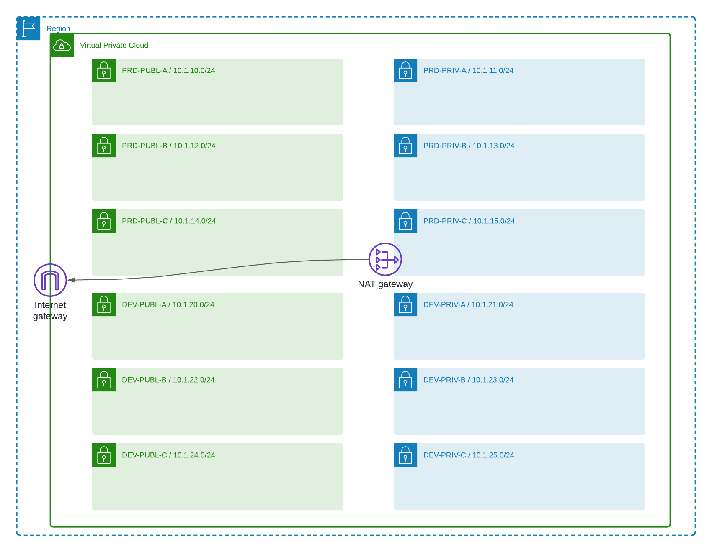

# diogoscs-wpaas
Repositório do projeto final da turma Descomplicando Terraform 2024 | WPAAS - Wordpress as a Service | por Diogo Soares

## Resumo

Projeto de conclusão do treinamento Descomplicando Terraform 2024 utilizando o conhecimento e as ferramentas aprendidas durante o curso: Terraform, Git, Packer e Ansible (e muito mais).

> [!IMPORTANT]
> Agradeço principalmente ao professor @gomex que vai além de um professor/facilitador, é um cara que realmente batalha sem vaidades e sem medir esforços para que a gente consiga evoluir a cada instante. A todo o time de colegas da turma, que sempre está ali para apoiar quem necessita e contribui demais com o aprendizado. E obviamente a @linuxtips capitaneado pelo sensacional @badtuxx são os únicos capazes de proporcionar esses encontros incríveis e de execelente qualidade! #VAII 

## Problemática
Os times de Operações do cliente, geram para seus consumidores, diversas estruturas de Wordpress como produto. Entretanto, devido a falta de padronização para implementação da infraestrutura, cada novo ambiente possui configurações diferentes, causando um

## Cenário Proposto
- Criação de uma pipeline de *Golden Images* para Wordpress utilizando Packer, Ansible e Terraform, com o objetivo de gerar imagens base do CMS.
- Arquitetura para entrega rápida de ambientes Wordpress, focada na criação de conteúdo e desenvolvimento da ferramenta, chamada WPaaS (WordPress como serviço).

## Tarefas
- [x] Módulo de VPC com a arquitetura base para a rede AWS.
- [ ] Pipeline Packer + Ansible das imagens base.
- [ ] Deploy de EC2

## Estrutura desse Repositório
Como o intuito do projeto é de criar uma estrutura próxima do ambiente real, seguindo boas práticas de segregação de arquivos e documentação, as pastas poderão ter funções que simulam finalidades específicas.
- Diretórios iniciados com `repo-` simulam uma estrutura de repositório apartada.

## Respositórios Secundários
> [!IMPORTANT]
> Fique atento à criação de recursos na AWS, pois eles podem gerar custos. Certifique-se de destruir a infraestrutura ao finalizar o laboratório. Para mais detalhes, consulte os recursos criados e a [tabela de preços](https://aws.amazon.com/pt/pricing/?aws-products-pricing.sort-by=item.additionalFields.productNameLowercase&aws-products-pricing.sort-order=asc&awsf.Free%20Tier%20Type=*all&awsf.tech-category=*all) correspondente."

### ./repo-aws-vpc/
Repositório com módulo para a criação dos recursos de rede base na AWS. Utilizado no projeto a região de Norte Virginia (us-east-1).

#### Instruções
1. Configurar o backend do tfstate (./repo-aws-vpc/backend.tf)
2. Autenticar na conta AWS. [Exemplos](https://registry.terraform.io/providers/hashicorp/aws/latest/docs#authentication-and-configuration) de como efetuar o acesso.
3. Definir variáveis locais no arquivo (./repo-aws-vpc/locals.tf)
4. ``terraform init``
5. ``terraform apply``

#### Requisitos
1. Conta na AWS
2. Credenciais de acesso, com os privilégios necessários.
> Para a criação da Stack foi utilizado a role default AdministratorAcces. Importante lembrar que o recomendado para a credencial seja a utilização da perssmião de mínimo privilégio possível. 

#### Módulos
[Módulo VPC do Registry do Terraform](https://registry.terraform.io/modules/terraform-aws-modules/vpc/aws/latest)

#### Recursos
- VPC
- 6 Subnets públicas (prd/dev)
- 6 Subnets privadas (prd/dev)
- 1 Nat Gateway
- 1 Internet Gateway
- 1 Route table pública / 1 Route table privada
- EIP para Nat Gateway

> [Diagrama](#diagrama-repo-aws-vpc) dos recursos criados.

## Diagramas
### Diagrama repo-aws-vpc

